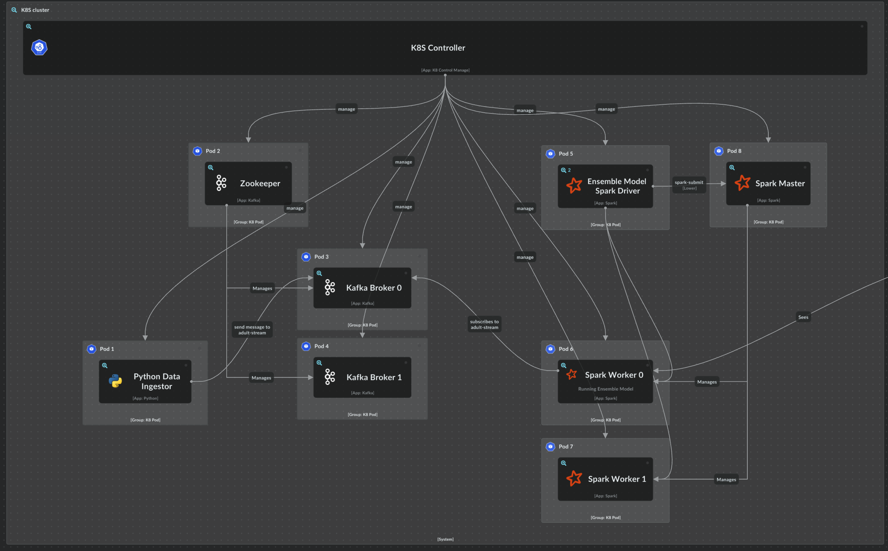

# Big Data Final Project

This repository contains the **Big Data** project by **Amin Haeri** and **Alireza Nazari**. The project is designed to handle real-time stream processing using distributed systems techniques and Apache Spark technologies.

## Project Overview


The project implements **Ensemble Learning on Streaming Data**. It leverages modern distributed systems tools and methodologies to achieve scalability and high performance.

- **Documentation**: [Documents](./docs/index.md) 
- **C4 Model Documentation**: [C4 Model Link](https://s.icepanel.io/qIhYcBpM0jN50I/9fDo)
- **Video Footage**: [Video Link](https://drive.google.com/file/d/1Rl0fL7nk9RiHS9mVY38V39b6A4rGqNeL/view?usp=sharing)

## Prerequisites

Before running the project, ensure the following tools are installed:

- **Minikube**: A tool that enables running Kubernetes clusters locally.
- **Kubectl**: The command-line tool for interacting with Kubernetes clusters.
- **Docker**: A containerization platform required for deploying applications in Kubernetes.

## Setup and Deployment

### Deploying the Project
To deploy the project, execute the deployment script:
```
bash scripts/deploy.sh
```

### Cleaning Up
To remove deployed resources and free up system resources, run:
```
bash scripts/clean.sh
```

### Optimizing Minikube Startup
To enhance Minikube performance, cache the following Docker images:

 `bitnami/kafka`
- `bitnami/spark:latest`
- `bitnami/zookeeper`
- `python:3.9-slim`

Add images to the Minikube cache using:
```
minikube cache add <image>
```

## Getting Started

1. Install all prerequisites as listed above.
2. Optimize Minikube with the caching instructions.
3. Deploy the project using the deployment script.
4. Monitor the system and analyze the results.

